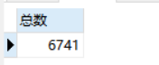
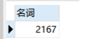
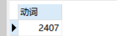
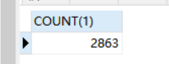
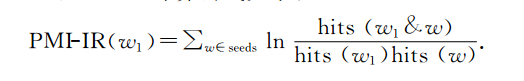
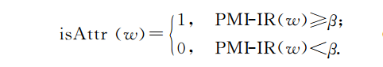

## GraduationDesign

描述：蔡维毕业设计

### 题目： 基于大数据平台的股评信息文本挖掘研究


### 模块说明
* get_data:爬取数据存入数据库，并将数据分词，分词数据也存入数据库
* screen:对分词的数据进行筛选，分为两轮。先通过词性模板将少数词过滤，在通过PMI-IR对词进行筛选。
* analyse:


### 打包说明
* 最后程序打包jar ,放在linux运行。  可以用到NiFi,（读取csv文件到mysql，hive等）

### 主要功能介绍
* 爬取数据[地址](http://stock.quote.stockstar.com/stockinfo_info/comment.aspx?code=900905&pageid=3)
* 地址解析：`http://stock.quote.stockstar.com/stockinfo_info/comment.aspx?code="+股票代码+"&pageid="+页数`
* 爬取工具: `Java,Jsoup`
  ```xml
        <dependency>
          <groupId>org.jsoup</groupId>
          <artifactId>jsoup</artifactId>
          <version>1.8.3</version>
        </dependency>
  ```
* 爬取数据去向
    * `txt`文件
    * `MySQL`
    * `Kafka` 用于实时分词，待定。
* 对数据进行分词
    * 分词工具 `Word` 版本：`1.3`
    ```xml
       <dependency>
            <groupId>org.apdplat</groupId>
            <artifactId>word</artifactId>
            <version>1.3</version>
       </dependency>
    ```
   
   
### 数据库 MySQL:120.79.24.24  
* 数据库：`graduation_design `
    * 表：
        * `comment`:id,stock_code,comment,create_time
        * `stock_term` : id,stock_code,article_id,sentence_id,stockTerm_id,stock_term,nature,create_time
        
        
        
### 股票相关术语（6个）
* 压力线：当股价上涨到某价位附近时，股价就会停止上涨，甚至回落。压力线起阻止股价继续上涨的作用。
* 支撑线：股价下跌时的关卡。
* 突破：股价冲过关卡，一般指向上突破。跌破：股价冲过关卡向下突破。
* 回档：在股市上，股价呈不断上涨趋势，终因股价上涨速度过快而反转回跌到某一价位这一调整现象称为回档。一般来说，股票的回档幅度要比上涨幅度小，通常是反转回跌到前一次上涨幅度的三分之一左右时又恢复原来的上涨趋势。
* 均线：
* 回调：

### 数据库相关操作
* 分析名词、动词的频率
    * SQL：
    ```SQL
    select count(1) from stock_term;
    select count(1) from stock_term where nature = '名词';
    select count(1) from stock_term where nature = '动词';
    ```
    > 频率=单独的次数/总数
    
    
    
    
* 词性路径模板统计
    * SQL：
    ```SQL
    //统计词性路径模板数
    select 
    b.comment_id,b.sentence_id,count(1) as `num`,b.sentence_nature,GROUP_CONCAT("-",b.sentence)
    from 
    (select 
    GROUP_CONCAT(a.nature) as `sentence_nature` ,GROUP_CONCAT(a.stock_term) as `sentence`,a.comment_id,a.sentence_id
    from 
    (SELECT 
    comment_id,sentence_id,nature,stock_term,stock_code 
    from stock_term s 
    where s.stock_code = "+股票代码+"
    ORDER BY s.comment_id,s.sentence_id,s.stock_term_id ) as `a`
    GROUP BY a.comment_id,a.sentence_id) as `b` 
    GROUP BY b.sentence_nature HAVING `num`>70 ORDER BY num desc;
  
  //得出总句子数
  select COUNT(1)
  FROM
  (select COUNT(1) as c from stock_term GROUP BY comment_id,sentence_id) as cc
    ```
    > 频率=词性模板对应的数/总句子数，筛选了一下，将频数小于70的去掉。
    
    
    
    
* 拿出筛选过后的词，进行下一步的筛选


### 特征词的过滤
* 在从训练语料中出现次数最多的前100个特征词中，手工挑选出股票6个典型属性。并加入产品类别名称“股票”。将其组成领域性特征词的种子集合Seeds，PMI-IR计算公式如下：

    * 式中，Seeds为6个股票的典型数据，hits(ω1)，hits(ω)分别代表特征词和经过BaiDu双引号技术精确匹配后返回的结果页面数，而hits(ω1&ω)则代表ω1和ω通过BaiDu共同精确匹配的结果页面数．候选特征词的PMI-IR值越高，则越可能是真正的产品特征词．这里需要设定一个阈值，大于阈值的候选特征词才被认为是真正的产品特征词，公式如下所示：
        
        
        
        为了确定PMI-IR算法中阈值的取值，首先从已抽取的候选特征词中挑选了456个产品属性特征词作为标准答案，然后利用准确率、召回率及调和平均值评估阈值取何值的情况下其结果最准确．实验表明，当β='--------------'时，可达到最优过滤效果．


* 筛选后的词，从数据库拿到这些词的全部信息，然后存入screen_term表。


### 特征词层面划分
* 先手动划分层面
* 拿到screen_term表的特征词数据，然后找到该词所在句子，判断自己中是否有否定词等消极的词，如果有就没有分，否则就加分。
* 否定词：1分    肯定词：5分  其他：3分